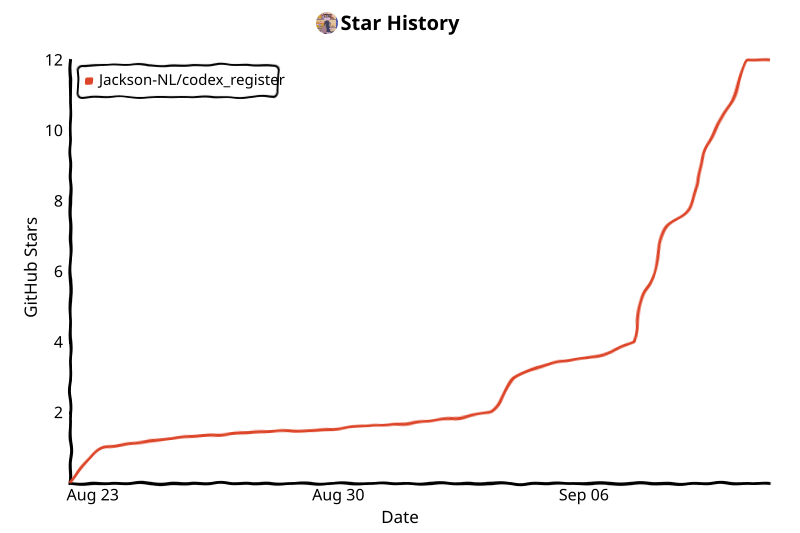

<p align="center">
  
</p>
<p align="center"><strong>code技术交流群 · 群号：1073672527</strong> — QQ 扫码加入群聊</p>

---

# 🚀 OpenAI / ChatGPT 全自动注册机 & Token 提取器


这是一个高度自动化的 ChatGPT / Codex 账号注册与凭据管理工具链。项目通过 **Camoufox 指纹伪装浏览器**完成邮箱 / 手机号全自动注册流程，集成 **Cloudflare Turnstile 对抗**、**Clash 节点轮换**与 **SMSBower 接码**，并能拦截原生 OAuth2 授权流，直接提取出最核心的 `access_token` 和 `refresh_token`，产出可导入 Sub2API 的凭据，附带账号维护、异常重登与支付链接提取能力。

## ✨ 核心特性

- 📷 **全自动邮箱注册**：Camoufox 在 `chatgpt.com` 走完整注册流程——临时邮箱接收验证码 → 设置密码 → 填写 about-you → OAuth 回调换取 token；支持批量注册，Gmail 订单模式下同一主邮箱可复用多个别名。
- 📱 **手机号注册**：对接 SMSBower 接码平台自动取号，在 OAuth 流程中完成 add-phone 验证；支持单浏览器会话内换号重试，号码风控自动取消并重新取号。
- 🔄 **Codex OAuth 重授权**：复用已登录浏览器 profile 走完整 PKCE 流程换取新 `refresh_token` / `id_token`；单账号与批量（并发 1~10）均支持，登录态失效时自动用本地邮箱/密码/TOTP 恢复登录。
- ☁️ **Sub2API 集成**：注册成功的账号一键或自动推送到 Sub2API 管理端，按分组上传、状态校验、凭据同步；远端异常账号拉回本地重登后新凭据回写并恢复调度。
- 🔗 **提链工作台**：选择已保存 token 的账号，复用 CS/OAICS Checkout、Stripe、PayPal/GoPay/GCash 提取逻辑，后台按并发执行；支持 **cliproxy 出口轮换重试**（失败自动换 sid）、**Stripe 段浏览器回退**（被 bot 检测拦截时切真实 Chromium fetch）、**双出口地区改写**（如印尼链路：checkout=ID、优惠=TH）、**账号优惠目录预检**（accounts/check 自动识别试用资格与专属 campaign id，无试用资格快速失败）与 **0 元校验**；页面只展示凭据是否存在，不展示完整 `access_token`。
- 🩺 **账号维护**：后台周期性用 `refresh_token` 刷新 AT/RT/ID Token，并调用 `wham/usage` 探测额度写回账号表。
- 🏷️ **账号标签**：注册批次标签自动写入新账号，账号管理页支持标签筛选与批量设置/清除。

## 🛡️ 风控对抗

- 🎭 **浏览器指纹**：Camoufox + humanize + geoip + block_webrtc；视口/DPR/locale 在浏览器启动前随机生成并通过启动参数注入，时区由 geoip 按出口 IP 注入引擎层；启动后回读真实运行时指纹写日志核验（`[env] 实际指纹:`），杜绝"计划值 ≠ 实际值"的排查陷阱。
- 🖱️ **行为层**：鼠标轨迹起点全视口随机、单一缓动曲线、与目标保持最小距离；姓名池 ~4.4 万组合避免按姓名聚类。
- 🌐 **IP 层**：静默期节点轮换——仅当没有其他进行中注册时，新任务启动前自动切换 Clash 出口（并发下单 IP 承载账号数 ≤ 并发数）；失败路径保留异常触发轮换。
- ☁️ **Cloudflare 宽限期**：检测到挑战页不立即失败，等待自动恢复后再继续。
- 🚦 **页面状态机**：每步之间主动探测页面阶段，区分 Cloudflare 挑战 / OpenAI 错误页 / 账号停用（`account_deactivated` 秒级快速识别）/ 页面卡住。
- ⏱️ **Gmail 订单超时保护**：连续 3 次验证码超时自动取消 SMSBower 订单。

## 🔧 环境准备与安装

1. **环境要求**：Python 3.13+、Node.js 18+、Camoufox 浏览器引擎（首次运行 `python -m camoufox fetch`）、Clash/Mihomo 代理、Cloudflare 账号 + 域名（部署临时邮箱 Worker）、SMSBower API Key。

2. **克隆项目**：

   ```bash
   git clone https://github.com/Jackson-NL/codex_register.git
   cd codex_register
   ```

3. **配置环境变量**：

   ```powershell
   cd backend
   copy .env.example .env
   ```

   编辑 `.env`，至少填写：

   - `SMSBOWER_API_KEY` — SMSBower 接码平台 API Key
   - `SMSBOWER_API_KEYS` / `SMSBOWER_KEY_STRATEGY` — 可选的多 Key 池（逗号分隔）与轮询策略（`round_robin` 顺序轮询 / `random` 随机）；非空时优先于单 Key，也可直接在「系统设置 → 接码设置」里维护。每新建一个订单（取号 / 租 Gmail）取一把 Key，订单的查码与取消复用创建它的那把 Key
   - `DEFAULT_PROXY` — 本地代理地址（默认 `http://127.0.0.1:7890`）
   - `CF_TEMP_EMAIL_BASE_URL` / `CF_TEMP_EMAIL_DOMAIN` — 已部署的 cf-temp-mail 地址
   - `CF_TEMP_EMAIL_ADDRESS_MODE` — `generated` 自动创建地址，或 `custom_pool` 使用自定义邮箱池
   - `CF_TEMP_EMAIL_CUSTOM_POOL` / `CF_TEMP_EMAIL_INBOX_ADDRESS` / `CF_TEMP_EMAIL_INBOX_JWT` — 自定义邮箱池地址、统一转发收件地址和收件凭证
   - `SUB2API_BASE_URL` / `SUB2API_ADMIN_API_KEY` — Sub2API 管理端地址和凭据（如需上传）
   - `SUB2API_REAUTH_REDIRECT_URI` — 可选的 Sub2API 远端 OAuth 回调地址；留空时使用 `${SUB2API_BASE_URL}/auth/callback`
   - `CLASH_CONTROLLER_URL` / `CLASH_CONTROLLER_SECRET` — Clash 控制器地址和密钥
   - `REGISTRATION_TAG` — 注册批次标签，自动写入新账号 `tag` 字段（可选）

   完整配置项见 [backend/.env.example](backend/.env.example)。

4. **安装依赖**：

   ```powershell
   # 后端
   cd backend
   pip install -r requirements.txt
   python -m camoufox fetch

   # 前端
   cd ..\frontend
   npm install
   ```

5. **部署临时邮箱 Worker**（cf-temp-mail）：详见 [cf-temp-mail/README.md](cf-temp-mail/README.md)。

## 🚀 启动服务

Windows 可直接双击根目录的 `start.bat`（默认重启占用 `8000/5173` 的旧服务，并等待健康检查），或在 PowerShell 中运行 `.\start.ps1`（保留已运行服务加 `-NoRestart`）。

也可手动分别启动：

```powershell
# 后端（不要加 --reload，浏览器子进程需要稳定的事件循环）
cd backend
$env:PYTHONUTF8 = "1"
python -m uvicorn app.main:app --host 127.0.0.1 --port 8000

# 前端
cd frontend
npm run dev -- --host 127.0.0.1
```

访问 `http://127.0.0.1:5173/`，API 文档（Swagger UI）：`http://127.0.0.1:8000/docs`。

## 🏗️ 项目结构

```
codex_register/
├─ backend/                    FastAPI 后端
│  ├─ app/
│  │  ├─ main.py              应用入口 + lifespan
│  │  ├─ config.py            环境配置（.env）
│  │  ├─ db.py                SQLAlchemy engine/session + 自动迁移
│  │  ├─ models.py            ORM 模型
│  │  ├─ schemas.py           Pydantic 序列化模型
│  │  ├─ api/                 路由模块
│  │  │  ├─ registrations.py  注册任务
│  │  │  ├─ batches.py        批量注册
│  │  │  ├─ accounts.py       账号管理 + Codex OAuth 批量重授权
│  │  │  ├─ sub2api.py        Sub2API 上传
│  │  │  ├─ sub2api_relogin.py 异常账号重登
│  │  │  ├─ link_extraction.py 提链工作台
│  │  │  └─ ...
│  │  └─ services/            核心业务
│  │     ├─ registrator.py     注册执行器（邮箱+手机号双路径）
│  │     ├─ registrations.py   注册任务编排 + 日志
│  │     ├─ batch.py           批量协调器
│  │     ├─ browser_stack.py   浏览器指纹/行为分层
│  │     ├─ cf_layer.py        Cloudflare Turnstile 处理
│  │     ├─ smsbower.py        SMS 接码
│  │     ├─ smsbower_mail.py   SMSBower 临时 Gmail
│  │     ├─ sub2api.py         Sub2API 上传客户端
│  │     ├─ sub2api_relogin.py 异常账号重登
│  │     ├─ clash_verge.py     Clash 代理轮换
│  │     ├─ link_extraction.py 提链任务编排
│  │     ├─ payment_link_extractor/  CS/OAICS Checkout、Stripe 支付链接提取
│  │     └─ mail_providers/    邮箱 Provider（CF临时邮箱 / Outlook）
│  ├─ scripts/                独立运维脚本（RT 批量刷新/OAuth 登录诊断等）
│  ├─ tests/                  pytest 测试
│  ├─ data/                   SQLite 数据库（不入库）
│  └─ profiles/               Camoufox 浏览器 profile（不入库）
├─ frontend/                   Vite + React SPA
│  ├─ src/
│  │  ├─ pages/               Dashboard / Register / CodexOAuth / Accounts /
│  │  │                       Sub2APIRelogin / LinkExtraction / Proxies /
│  │  │                       MailConfig / Settings / Admin
│  │  ├─ components/          UI 组件
│  │  └─ api/                 后端 API 封装
│  └─ test/                   前端测试
├─ cf-temp-mail/               Cloudflare Worker 临时邮箱
│  ├─ src/index.js            email handler + HTTP API
│  └─ wrangler.toml
└─ skills/                    Agent 技能（Codex OAuth 重授权链路说明等）
```

## 📡 API 概览

| 前缀 | 模块 | 功能 |
|---|---|---|
| `/api/registrations` | registrations | 注册任务管理与调试 |
| `/api/batches` | batches | 批量注册 |
| `/api/accounts` | accounts | 账号 CRUD / 标签 / 导入导出 / Codex OAuth 批量任务 |
| `/api/gmail-sessions` | gmail_sessions | SMSBower 临时 Gmail 会话 |
| `/api/sub2api` | sub2api | Sub2API 上传/校验/状态同步 |
| `/api/sub2api/relogin` | sub2api_relogin | 远端异常账号重登 |
| `/api/link-extraction` | link_extraction | Checkout 支付链接提取 |
| `/api/proxies` | proxies | 代理池管理 |
| `/api/settings` | settings | 运行时配置读写 |
| `/api/mail-config` | mail_config | 邮箱 Provider 配置 |
| `/api/stats` | stats | 仪表盘统计 |
| `/api/tasks` | tasks | 任务查询 |

## 🗃️ 数据模型

| 表 | 说明 |
|---|---|
| `accounts` | 注册成功的账号（OAuth 令牌、TOTP、额度状态、冷却期、批次标签 `tag`）|
| `registrations` | 注册任务（状态、日志、结果、邮箱来源）|
| `batches` | 批量注册任务 |
| `gmail_sessions` | SMSBower 临时 Gmail 会话（别名复用）|
| `sub2api_relogin_jobs` / `sub2api_relogin_items` | 重登任务及子项 |
| `account_sub2api_uploads` | 账号在 Sub2API 各分组的状态 |
| `link_extraction_jobs` / `link_extraction_items` | 提链任务、账号阶段和支付链接结果 |
| `proxies` | 代理池 |
| `oauth_logs` | OAuth 日志持久化 |
| `ui_settings` | 前端设置 JSON |

旧数据库启动时自动 `ALTER TABLE` 补齐新字段，无需手动迁移。

## 🧪 测试

```powershell
# 后端
pytest backend/tests -q

# 前端
cd frontend
npm test -- --test-reporter=dot
npm run build
```

## 🩺 排错

| 现象 | 原因 | 处理 |
|---|---|---|
| `invalid_grant` | RT 已失效 | 用 Codex OAuth 重授权（批量接口或单账号） |
| `401 session has ended` | RT 过期/被吊销 | 同上 |
| `refresh token has already been used` | RT 已在其他端被消费（轮换冲突）| 本地 RT 作废，重新 OAuth |
| `account_deactivated` | 账号被 OpenAI 停用 | 无法恢复；标记 unhealthy 并从下游移除 |
| `401/403` | AT/账号态不可用 | 确认 RT 是否可刷新 |
| `429/rate_limit` | 额度或接口限流 | 等待窗口恢复 |
| Cloudflare 挑战 | IP/指纹被拦截 | 轮换代理节点，检查 Camoufox 指纹配置 |
| `fraud_guard` | 风控拦截 | 换代理/换号段/换 profile |
| 提链 `This promotion is not available` | 账号未被试用活动定向（`check_coupon` 的 eligible 只代表券码存在） | 以提链预检的账号优惠目录为准；无目录时该账号无法 0 元提链 |
| 提链 `checkout/confirm blocked` | chatgpt 风控拒绝该账号支付确认 | 换出口/换账号；浏览器回退也无法绕过账号级标记 |
| OTP 未收到 | 接码平台延迟/号码被回收 | resend 或取消换号 |
| `响应中缺少 access_token` | OAuth token endpoint 未返回 AT | 检查 OAuth 流程是否完整 |

## ⚠️ 注意事项

- 后端**不要**使用 `--reload` 启动，浏览器自动化和 Gmail 子进程需要稳定的事件循环。
- 日志默认以明文存储（含密码/验证码/TOTP），便于排查。可通过 API `POST /api/registrations/log-redact` 临时开启脱敏。
- SQLite 单机部署，并发写入有限。`check_same_thread=False` + `timeout=10` 已设置，但高并发下仍可能锁库。
- API 当前无鉴权，CORS 全开（`allow_origins=["*"]`），仅适用于本地内网环境，不要暴露到公网。
- `data/`、`profiles/`、`.env`、`output/` 均已在 `.gitignore` 中排除，请勿提交到公共仓库。

## 📄 免责声明

本项目仅供学习与研究，用于理解浏览器自动化、反爬机制与系统架构设计。使用者应遵守目标服务的用户协议与当地法律法规，因使用本工具产生的任何后果由使用者自行承担。

## 📈 Star History

<!-- star-history:start -->
<picture>
  <source media="(prefers-color-scheme: dark)" srcset="assets/star-history/star-history-dark.svg">
  
</picture>
<!-- star-history:end -->
